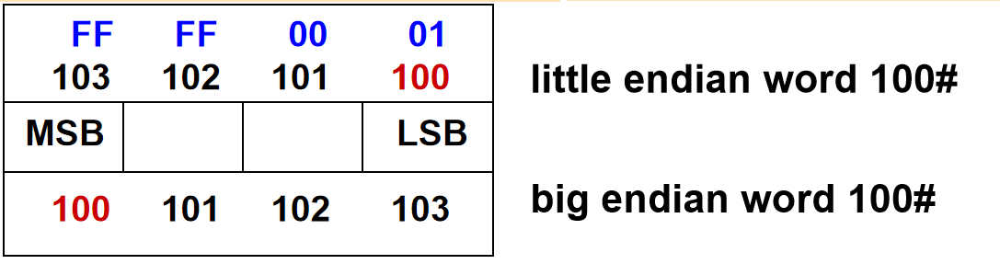

## 1.冯诺依曼结构

#### 基础知识：

- 每条指令由**操作码**和**地址码**两部分组成。
- 操作码指出操作类型，地址码指出操作数的地址

- MAR：存储器地址寄存器
- MDR：存储器数据寄存器
- GPRs：通用寄存器组

#### 机器执行指令步骤：

1. 根据PC取指令
2. 指令译码
3. 按地址取操作数
4. 指令执行
5. 按地址回写结果
6. 修改PC的值

## 2.进制转换

1. $(0.10101)_2=(000.101010)_2=(0.52)_8$
2. $(10101.01)_2=1\times2^4+1\times 2^2+1\times2^0+1\times2^{-2}=(21.25)_{10}$
3. $(3A. 1)_{16}=3\times16^1+10\times16^0+1\times16^{-1}=(58.0625)_{10}$
4. $(4123.25)_{10}=4096+16+8+2+1+0.25=(1000000011011.01)_2=(101B.4)_{16}$

## 3.数值数据表示

- 原码：最高位为符号位（0正1负），但0的表示不唯一，减法实现困难
	- $[3]_{\text{原}}=0000\,0011$
	- $[-6]_{\text{原}}=1000\,0110$
	- 表示范围：$- (2^{n-1} - 1) \sim + (2^{n-1} - 1)$ 

- 补码：正数时等于原码，负数时为该负数绝对值的“各位取反，末位加一”
	- $[x]_{\text{补}}=2^n+X\quad \left(-2^{n-1}\leq X\leq 2^{n-1}\pmod{2^n}\right)$
	- $[3]_{\text{补}}=0000\,0011$
	- $[-6]_{\text{补}}=1111\,1010$
	- 表示范围：$-2^{n-1} \sim + (2^{n-1} - 1)$ 

- 移码：$\text{移码}=\text{补码}+\text{偏移量}$ 
	- $\text{偏移量}=2^{n-1},n\text{是移码的总位数}$（在IEEE 754中不同）
	- $[-6]_{\text{移}}=0111\,1010$
	- 表示范围：$-2^{n-1} \sim + (2^{n-1} - 1)$ 

## 4.浮点数表示(IEEE 754)

- 第0位：数符S
- 第1~8位(Exponent)：8位移码表示阶码E（偏置常数为127）
- 第9~31位(Signnificand)：24位二进制原码小数表示的尾数M
	-  规格化要求尾数必须是1.xxxx形式（整数部分为1）
	-  约定第一位默认的“1”不明显表示出来。最终就用23个数位表示24位尾数
$$SP:(-1)^S\times(1+Significand)\times 2^{Exponent-127}$$
- 最大正数：$1.11\cdots1\times2^{11\cdots0-127}$ 对应真值$(2 - 2^{-23}) \times 2^{127}$
- 最小正数：$1.00\cdots0\times2^{00\cdots1-127}$ 对应真值$1\times2^{-126}$

| **Exponent** | **Significand**              | **Object**               |
| ------------ | ---------------------------- | ------------------------ |
| 1–254        | anything（implicit leading 1） | **Normalized number**    |
| 0            | 0                            | **Zero**                 |
| 0            | nonzero                      | **Denormalized (非规格化数)** |
| 255          | 0                            | **Infinity**             |
| 255          | nonzero                      | **NaN**                  |

- +0：   0 00000000 00000000000000000000000
- -0 ：   1 00000000 00000000000000000000000
- $+\infty$ ：0 11111111 00000000000000000000000
- $-\infty$ ：0 11111111 00000000000000000000000

## 5.BCD码

- 8421码
- 余3码
	- 由8421码加上0011形成。当两个十进制数字之和是10时，和的二进制编码值正好是16，而且0和9，1和8，…，5和4的余3码互为反码（各二进制位都相反）
	- 0 --> 0011 , 7 --> 1010 , 9 --> 1100
- 格雷码

## 6.大端存储与小端存储

- LSB：表示最低有效字节
- MSB：表示最高有效字节

> 例如，若 32位int i = -65535，其地址为内存100号单元（即占100#～103#），则用“取数”指令访问100号单元取出 i 时，必须清楚 i 的4个字节是如何存放的。

- 大端方式（Big Endian）:  MSB所在的地址是数的地址
- 小端方式（ Little Endian）:  LSB所在的地址是数的地址
