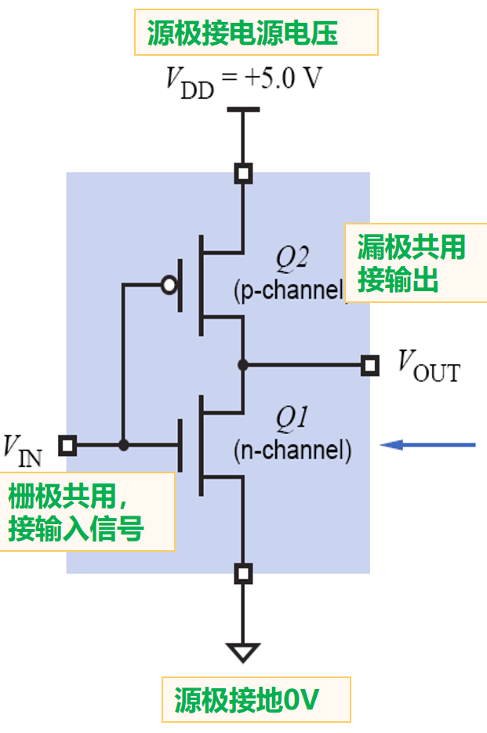
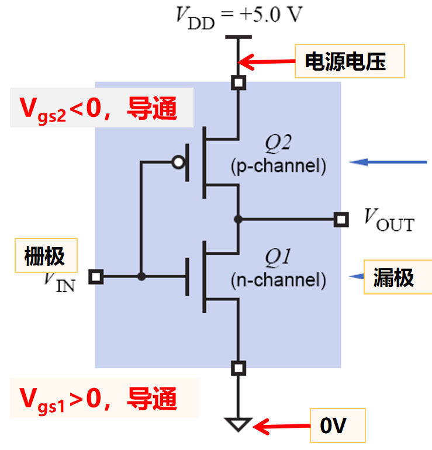
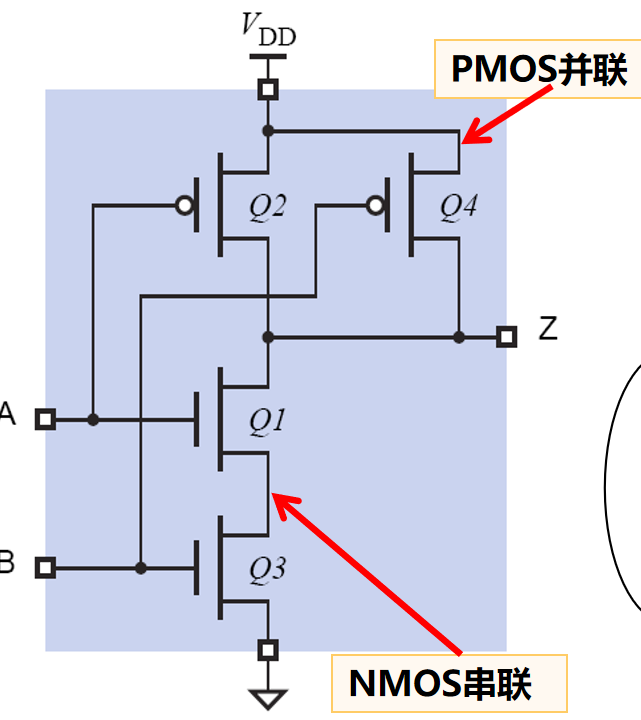
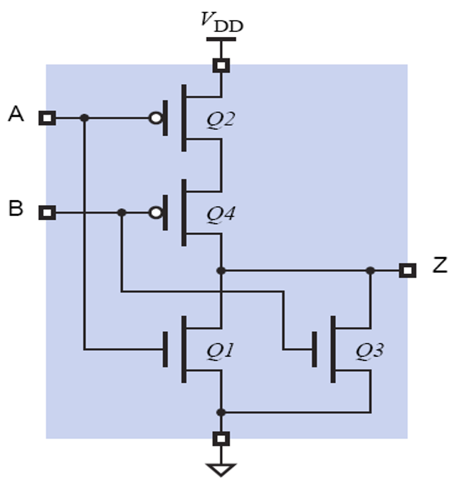

## 1.CMOS晶体管

  
  

> CMOS晶体管以互补的形式共用一对NMOS 和PMOS 晶体管

- NMOS：高电平导通，源极连接地线GND
- PMOS：低电平导通，源极连接电源电压$V_{DD}$ 
- 改变栅极的输入电压值（使得Q1和Q2只会有一个导通），从而改变漏极的输出电压值

## 2.CMOS实现与、或、非门

  
  
  

           非门                                与非门                              或非门

- 非门：一对CMOS晶体管实现
- 与非门：NMOS串联（$Q_1,Q_3$）PMOS并联（$Q_2,Q_4$）
- 或非门：NMOS并联（$Q_1,Q_3$）PMOS串联（$Q_2,Q_4$）

> 受电气特性的限制，输入端不能无限制增加。一般输入端数目小于等于5，不超过8 个。

## 3.CMOS实现传输门

- 传输门由一对CMOS晶体管以及控制信号EN组成
- 信号EN（使能端）用于控制晶体管的导通与截止, 其功能相当于一个逻辑控制开关。
	- 当EN为高态时，若传输的是低态信号，则NMOS管导通；否则是PMOS管导通。
	- 若EN为低态时，两个MOS管都截止。
- [原理图](https://zh.wikipedia.org/zh-cn/%E4%BC%A0%E8%BE%93%E9%97%A8)

## 4.布尔代数

- 吸收律：$X+X\cdot Y=X$ ，$X\cdot(X+Y)=X$
- 德$\cdot$ 摩根定理：
	- $\overline{X_1\cdot X_2\cdot \cdots \cdot X_n}=\overline{X_1}+\overline{X_2}+\cdots+\overline{X_n}$
	- $\overline{X_1+X_2+\cdots+X_n}=\overline{X_1}\cdot\overline{X_2}\cdot\cdots\cdot\overline{X_n}$

## 5.逻辑函数

- 标准乘积项（最小项）：每个逻辑变量出现且仅出现一次。$n$个变量的标准项共有$2^n$个。
	- $Ex.$ $A\cdot \overline{B}\cdot C$ ，$\overline{A}\cdot B\cdot \overline{C}$
	- 每个最小项对应真值表中一个输入组合，赋值该输入组合后，最小项的运算结果为1
	- 若某输入组合对应的二进制数值为$i$，则用$m_i$表示该最小项，$i$称为该最小项的编号
	- $\overline{A}\cdot\overline{B}\cdot C$只有当输入001时，结果为1，最小项编号为$m_1$
- 标准求和项（最大项）：同上
	- $\overline{A}+\overline{B}+C$只有输入110时，结果为0，最大项编号为$M_6$
### （1）标准和/最小项列表：

$\displaystyle Y=\overline{A}\cdot\overline{B}\cdot\overline{C}+A\cdot B\cdot\overline{C}+A\cdot B\cdot C=\sum m(0,6,7)$
### （2）标准积/最大项列表：

$\displaystyle Y = (A + B + \overline{C}) (A + \overline{B} + C) (A + \overline{B} + \overline{C}) (\overline{A} + B + C) (\overline{A} + B + \overline{C}) = \prod M(1,2,3,4,5)$

- 真值表的表示是唯一的，因此标准项列表的表示也是唯一的。

## 6.卡诺图化简

- 编号按照格雷码的顺序排列，即相邻编号只有1位不同
- 相邻$2^i$个“1单元” 可以合并成一个乘积项，并消去$i$个不同的变量
- [Example](https://zh.wikipedia.org/wiki/%E5%8D%A1%E8%AF%BA%E5%9B%BE)
### （1）蕴涵项

- 蕴涵项是一个乘积项，覆盖了逻辑函数的1个或多个最小项
- $F(X,Y,Z)=\sum (3,5,6,7)$的蕴涵项有：$\overline{X}\cdot Y\cdot Z$、$X\cdot Y\cdot Z$和$Y\cdot Z$等
### （2）质蕴涵项

- 不能被逻辑函数的其它蕴涵项所覆盖的蕴涵项
- $F(X,Y,Z)=\sum (3,5,6,7)$的质蕴涵项有：$Y\cdot Z,X\cdot Z, X\cdot Y$
### （3）实质蕴涵项

- 覆盖的最小项中至少有一个最小项是没有被其他质蕴涵项所覆盖的质蕴涵项
- $F(X,Y,Z)=\sum (3,5,6,7)$的实质蕴涵项有：$Y\cdot Z,X\cdot Z, X\cdot Y$
- 质蕴涵项覆盖的最小项越多（即卡诺圈越大）越可能是实质蕴涵项

> 最小覆盖：包含质蕴涵项数最少，并且质蕴涵项中的变量总数也是最少
$$\text{最小覆盖对应的逻辑表达式称为：最简逻辑表达式
}$$

