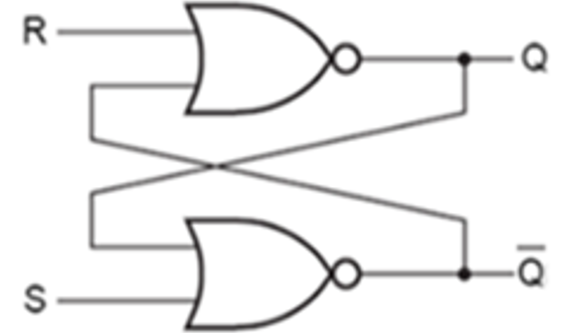
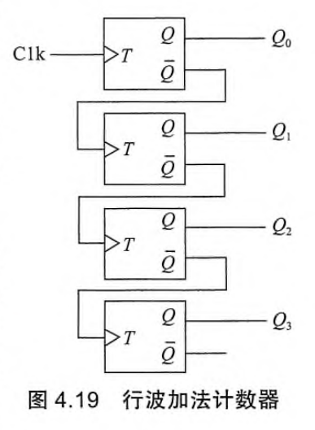

> 输出结果不仅取决于当前时刻的输入值，而且取决于电路过去时刻的行为（当前状态、现态、旧状态）

## 1.基本结构

- 状态记忆模块：由多个状态记忆单元构成（存储元件）
- 次态激励逻辑模块F ：激励函数（现态和外部输入的逻辑函数）
- 输出逻辑模块G ：输出函数（现态和外部输入的逻辑函数）
	- Mealy型：输出依赖于当前状态和当前输入信号
	- Moore型：输出仅依赖于当前状态，和当前输入信号无关

- 边沿触发方式分为上升沿触发和下降沿触发两种类型

## 2.双稳态元件

- 用1个或多个输入信号能驱动双稳态元件进入稳定状态，这些输入信号称为激励信号或激励输入
- 包括锁存器(latch) 、触发器(flip-flop)：
	- 锁存器（latch) ：通过激励输入的电平信号来控制存储元件的状态
	- 触发器（flip-flop）：具有时钟控制信号(clock) ，通过时钟信号的边沿来触发存储元件改变状态

### （1）SR锁存器

- 置位复位锁存器(Set-Reset latch)：具有置位和复位激励信号
	- 置位激励信号Set有效时，强制存储元件的输出Q为1
	- 复位激励信号Reset有效时，强制存储元件的输出Q为0

  
  

- 使用一对交叉耦合的或非门构成双稳态电路，也称为置位-重置（复位）锁存器。
- S是置位输入端，R是重置输入端
- [康康Wiki](https://zh.wikipedia.org/wiki/%E9%94%81%E5%AD%98%E5%99%A8)

| S   | R   | Q (输出) | 描述        |
| --- | --- | ------ | --------- |
| 1   | 1   | 保持原值   | 保持状态      |
| 0   | 1   | 1      | 置位        |
| 1   | 0   | 0      | 复位        |
| 0   | 0   | ❌非法    | 同时置位复位，冲突 |

- 从输入驱动信号有效开始，到输出达到稳定为止有一定的延迟，这个延迟称为**触发延迟**或**锁存延迟**
- 次态（特征）方程：
$$
\begin{cases}
Q^* = S + \overline{R} \cdot Q \\
S \cdot R \ne 1 \quad \text{（约束条件）}
\end{cases}
$$
### （2）D锁存器

| C（使能） | D（输入） | Q（输出） | 描述        |
| ----- | ----- | ----- | --------- |
| 0     | X     | Q（保持） | 不更新，保持原状态 |
| 1     | 0     | 0     | 记住 0      |
| 1     | 1     | 1     | 记住 1      |
- 特征方程：$Q^*=D\quad (C=1)$

### （3）D触发器

| 特性         | D 锁存器（D Latch）         | D 触发器（D Flip-Flop）    |
| ---------- | ---------------------- | --------------------- |
| **触发方式**   | 电平触发（Level-triggered）  | 边沿触发（Edge-triggered）  |
| **时序控制信号** | **使能 EN**，高电平时更新       | **时钟 CLK**，在上升沿/下降沿更新 |
| **输出变化时机** | 只要 EN=1，D 改变就立即影响 Q    | 只有在时钟沿来临时 D 才更新到 Q    |
| **用途**     | 用于异步逻辑或简单存储            | 用于同步时序逻辑、寄存器、计数器等     |

#### 具有预置和清零端的D触发器

- 预置端PR（preset）：将Q置1
- 清零端CLR（clear）：将Q清0

- 在电路工作的最开始进行置位或清0
- 预置端和清零(复位)端都是低电平有效信号

### （4）T触发器

> 在每个时钟脉冲T的触发边沿都会改变状态  [康康Wiki](https://zh.wikipedia.org/wiki/%E8%A7%A6%E5%8F%91%E5%99%A8#T%E8%A7%A6%E5%8F%91%E5%99%A8)

## 3.同步时序逻辑设计

检测一连串0/1输入序列中是否出现“101”

- 根据次态函数和选择的状态记忆单元（触发器）推导出激励函数

## 4.时序分析

### 时序电路的时间约束条件

- 时钟周期 $t_{clk} >$ 触发器锁存延迟 $t_{ffpd}$ ＋ 次态激励延迟 $t_{nspd}$ ＋ 触发器建立时间 $t_{setup}$

- 触发器保持时间 $t_{hold} <$ 触发器锁存延迟 $t_{ffpd}$ ＋ 次态激励延迟 $t_{nspd}$

- 时钟周期 $t_{clk} >$ 输出逻辑延迟 $t_{outpd}$

## 5.计数器

### （1）行波加法计数器

  

由此可知，若该计数器状态编码$Q_3 Q_2 Q_1 Q_0$从 0000 开始：

- 第 1 个时钟上升沿后，$Q_0$从 0 变 1，其它不变，得 0001；
- 第 2 个时钟后，$Q_0$变 0，$Q_1$从 0 变 1，得 0010；
- 第 3 个时钟后，$Q_0$变 1，其它不变，得 0011；
- 第 4 个时钟后，$Q_0$变 0，$Q_1$变 0，$Q_2$从 0 变 1，得 0100；
- 依此类推……

### （3）同步4位并行加法计数器
  
  

假定计数器的初始状态编码 Q3​Q2​Q1​Q0​ 为 0000，在 CntEn 为 1 时开始计数。

1. 当第一个 Clk 输入信号的上升沿到来后，最低位状态 Q0​ 从 0 变成 1，此时其他三个触发器的 En 端都是 0，故状态位不变，因而得到状态编码 0001；
2. 第 2 个 Clk 有效信号到来后，Q0​ 从 1 变成 0，此时 Q1​ 从 0 变成 1，而其他两个状态位不变，因而得到状态编码 0010；
3. 第 3 个 Clk 有效信号到来后，Q0​ 从 0 变成 1，此时其他三个状态位不变，因而得到状态编码 0011；
4. 第 4 个 Clk 有效信号到来后，Q0​ 和 Q1​ 从 1 变成 0，此时 Q2​ 从 0 变成 1，Q3​ 状态位不变，因而得到状态编码 0100……

改进：状态转换过程中的信号传递仅仅是一个与门，状态反转后可很快形成稳定的次态激励逻辑信号，因此效率最高

### （3）异步行波减法计数器

计数器的复位信号$Clear$连接4个$D$触发器的复位端$Rst$，最低位$Q_0$​对应的 $D$触发器的时钟信号连接计数器的计数时钟信号$Clk$，而其他三个$D$触发器的时钟信号分别连接前一位触发器的$Q$端，并且每个触发器的$\overline{Q}$连接自身的数据输入端$D$

 状态转换过程为：$0000\to 1111\to 1110\to 1101\to1100\to  \cdots\to 0001\to 0000$
 
## 6.寄存器与寄存器堆

### （1）寄存器

- 在时钟的有效边沿到来时，它会并行地捕获并存储当前在其数据输入端 ($D_{n−1}​$到 $D_0$​) 上的所有 n 位数据。
- 这些存储的数据会立即在输出端 ($Q_{n−1}​$ 到 $Q_0$​) 上显示出来，并且会一直保持稳定，直到下一个时钟有效边沿到来，存储新的数据。

### （2）寄存器堆

- 寄存器堆也称为通用寄存器组 (General Purpose Register set, GPRs)，它由许多寄存器组成，每个寄存器有一个编号，CPU 可以对指定编号的寄存器进行读写。
- 图 4.24a 是一个带时钟控制的双口寄存器堆的示意图，有两个读口和一个写口，每个读口或写口包括一个寄存器编号输入端和一个读数据端或写数据端。此外，还有一个写使能输入端 WE，它用来控制是否在下个时钟触边沿到来时，开始将 busW 上的数据写入寄存器堆中。

| 寄存器           | 名称           | 用途                   |
| ------------- | ------------ | -------------------- |
| `x0`          | `zero`       | 恒为零，用于常量 `0` 或丢弃结果。  |
| `x1`          | `ra`         | 返回地址，由 `jal` 指令自动写入。 |
| `x2`          | `sp`         | 栈指针，管理函数调用栈。         |
| `x3`          | `gp`         | 全局指针，用于访问全局变量。       |
| `x4`          | `tp`         | 线程指针，用于线程局部存储。       |
| `x5` ~ `x7`   | `t0` ~ `t2`  | 临时寄存器，函数调用时可随意修改。    |
| `x8`          | `s0` / `fp`  | 保存寄存器，也可用作帧指针。       |
| `x9`          | `s1`         | 保存寄存器，函数调用时必须保存。     |
| `x10` ~ `x17` | `a0` ~ `a7`  | 函数参数传递和返回值寄存器。       |
| `x18` ~ `x27` | `s2` ~ `s11` | 保存寄存器，函数调用时必须保存。     |
| `x28` ~ `x31` | `t3` ~ `t6`  | 临时寄存器，函数调用时可随意修改。    |
### （3）移位寄存器

假设该移位寄存器的初始状态编码 $Q_3​Q_2​Q_1​Q_0​$ 为 $0000$，在开始的 8 个时钟$t_0​∼t_7​$内，输入端 X 的输入信号依次为$1、0、0、1、1、0、1、1$，则该移位寄存器在每个时钟到来后的状态转换过程如表所示。

| **Clk** | **X** | **Q3​** | **Q2​** | **Q1​** | **Q0​** | **Clk** | **X** | **Q3​** | **Q2​** | **Q1​** | **Q0​** |
| ------- | ----- | ------- | ------- | ------- | ------- | ------- | ----- | ------- | ------- | ------- | ------- |
| t0​     | 1     | 0       | 0       | 0       | 0       | t4​     | 1     | 1       | 0       | 0       | 1       |
| t1​     | 0     | 1       | 0       | 0       | 0       | t5​     | 0     | 1       | 1       | 0       | 0       |
| t2​     | 0     | 0       | 1       | 0       | 0       | t6​     | 1     | 0       | 1       | 1       | 0       |
| t3​     | 1     | 0       | 0       | 1       | 0       | t7​     | 1     | 1       | 0       | 1       | 1       |
